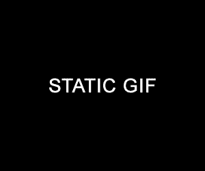

gifPlayer
========

A simple jQuery based gif player script. 

Just need to add the class **playergif** to the desired **img** tag. The **src** property should point to the static image and the **data-swap** property should point to the animated gif.

```

```
